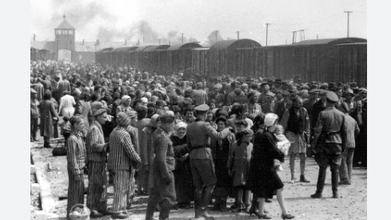

# Data_Analysis

## Mon premier projet d'Analyse de données

## Contexte
  
 Dans ce projet d'analyse de données qui est le mien, j'utiliserai le jeu de données des deportés norvegiens 
 lors de la seonde guerre mondiale,  qui ont étés déportés dans le camp d'Auschwits en 1940 à la suite
 de la guerre qu'Hitler a declanché en 1939. lors de cette geurre, beaucoup de camp de concentration ont été
 établi principalement contre les juifs et quelques prisonniers de guerre.
 * j'ai accès à des informations sur une partie des deportés (768 déportés) norvegiens. 
 * Pourquoi certains déporté ont survécu et d'autres sont morts?
 * Commencons l'analyse de données

## Chargement de données

Les donnés sont dans un tableau au format xlsx(excel):